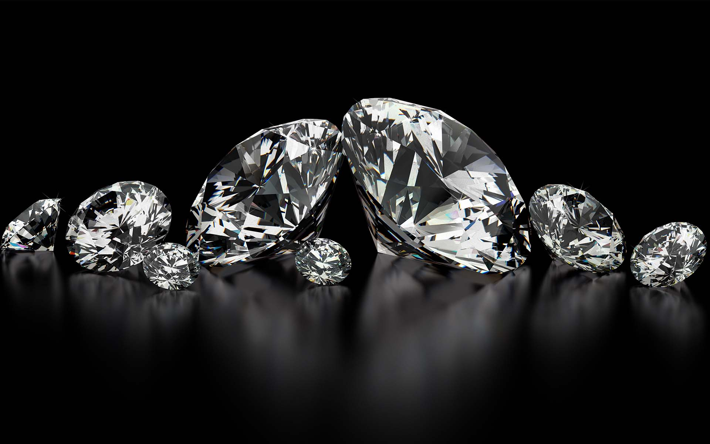
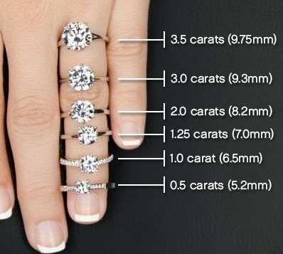

* Name: Renan Sallai Iwayama
* GitHub id: "rsallaii"

```{r r_setup, include = FALSE}
## initial settings
knitr::opts_chunk$set(
  comment = NA,
  echo = TRUE,
  error = TRUE,
  cache = FALSE,
  message = FALSE,
  dpi = 96,
  warning = FALSE
)

## width to use when printing tables etc.
options(
  width = 250,
  scipen = 100,
  max.print = 5000,
  stringsAsFactors = FALSE
)

## load radiant packages if needed
if (!exists("r_environment")) library(radiant)
```

<style>
.table {
  width: auto;
}
ul, ol {
  padding-left: 18px;
}
pre, code, pre code {
  overflow: auto;
  white-space: pre;
  word-wrap: normal;
  background-color: #ffffff;
}
</style>

# Exploratory Data Analysis

Let's do an Exploratory Data Analysis using the Diamond dataset available in the radiant package.

Diamond dataset contain the prices and other attributes of a sample of 3000 diamonds. 
The following analysis can be very helpful to understand which diamond properties drive diamond price.

But, what exactly a diamond is?

```{r , echo=FALSE, out.width = '50%'}

```

Diamond is a solid form of the element carbon with its atoms arranged in a crystal structure called diamond cubic. Diamonds are very rare and can only be created under conditions of high temperature and pressure over time. This extreme condition create a clear and colourless crystalline form of the pure carbon. Because of that, they acquire such a hardness that they can only be scratched only by other diamonds.

obs. Unfortunately, this dataset does not contain information about the country, brand and shape of the diamond that plays an important role in its price. Let's assume that all diamonds are from the same country, same brand and have the same shape.

```{r}
## loading the data.
df <- radiant.data::diamonds
```

To start let's explore the data structure and variable types using the function glimpse from dplyr:

```{r}
glimpse(df)
```
## Variables

price = price in US dollars (`r "$338-$18,791"`)

carat = weight of the diamond (0.2-3.00)

clarity = a measurement of how clear the diamond is (I1 (worst), SI2, SI1, VS2, VS1, VVS2, VVS1, IF (best))

cut = quality of the cut (Fair, Good, Very Good, Premium, Ideal)

color = diamond color, from J (worst) to D (best)

depth = total depth percentage = z / mean(x, y) = 2 * z / (x + y) (54.2-70.80)

table = width of top of diamond relative to widest point (50-69)

x = length in mm (3.73-9.42)

y = width in mm (3.71-9.29)

z = depth in mm (2.33-5.58)

date = shipment date

```{r}
df <- df %>%
  mutate(year = year(date), month = month(date)) %>%
  mutate(year=as.factor(year),month=as.factor(month))
```

First, let's look at the shipment date of the diamonds to understand how many diamonds per month are shipped:

```{r fig.width = 7, fig.height = 5, dpi = 144, out.width = '75%'}
df %>%
  group_by(year, month) %>%
  summarize(qty=n()) %>%
  ggplot(aes(x=month,y=qty,group=year)) + 
  geom_point(size=3) + 
  geom_line(size=0.5) + 
  facet_wrap(~year,nrow=1) + 
  theme(legend.position="none")

```

From this plot we can notice that there is not continuos shippment of diamonds and the quantities over the years/months vary a lot.

Now, let's create some visualization and statistical analysis to understand how diamond properties affect price.

## Price

The distribution plot of the price shows that the price of diamonds is highly skweed to the right and most of them have a price bellow $5,000.

```{r fig.width = 7, fig.height = 5, dpi = 144, out.width = '75%'}
visualize(
  df, 
  xvar = "price",
  type = "dist", 
  custom = FALSE
)
```

## 4Cs

Accordingly to [BlueNile](https://www.bluenile.com/education/diamonds?track=NavEdu4c), the 4 main properties of a diamond are Carat, Cut, Color and Clarity (4Cs):

- The term [carat](https://www.bluenile.com/education/diamonds/carat-weight) actually refers to the diamond's total weight and not its size.

- The most important of the 4Cs is [cut](https://www.bluenile.com/education/diamonds/cut) because it has the greatest influence on a diamond's sparkle.

- The second most important of the 4Cs is [color](https://www.bluenile.com/education/diamonds/color), which refers to a diamond's lack of color. The less color, the higher the grade.

- The least important of the 4Cs is usually [clarity](https://www.bluenile.com/education/diamonds/clarity) because the tiny imperfections are often microscopic.

```{r fig.width = 7, fig.height = 5, dpi = 144, out.width = '75%'}
visualize(
  df, 
  xvar = c("carat", "cut", "color", "clarity"), 
  type = "dist", 
  custom = FALSE
)
```

We can see in all the plots that the diamond properties are not evenly distributed. Specially, the carat plot is also very right skweed.

From the sellers perspective it is key to have the optimal range of diamonds that clients are looking forward to buy. 

There is a clear trade-off in this decision because the inventory cost of a diamond is very expensive, but at the same time you want to offer as many combinations as possible of the 4Cs to the consumers. 

That is one reason that companies like BlueNiles are growing fast with e-commerce.

### Carat

```{r , echo=FALSE, out.width = '50%'}

```


Now, let's check how price is related to carat with a scatter plot:

```{r fig.width = 7, fig.height = 5, dpi = 144, out.width = '75%'}
visualize(
  diamonds, 
  xvar = "carat", 
  yvar = "price", 
  type = "scatter", 
  nrobs = 1000, 
  check = c("line", "loess"), 
  custom = FALSE
)
```

There is a clear positive correlation between price and carat.

However, accordingly to BlueNile educational website "diamond prices increase exponentially with carat weight because the larger the carat, the more rare the diamond."

That doesn't seems to be true looking at this plot! 

This is happening because there is no control for other specific characteristics of the dimaonds like Cut, Color and Clarity (e.g. Ideal, D, VS2 / 55 observations).

```{r fig.width = 7, fig.height = 5, dpi = 144, out.width = '75%'}
visualize(
  df, 
  xvar = "carat", 
  yvar = "price", 
  type = "scatter", 
  nrobs = 1000, 
  check = "loess", 
  data_filter = "color=='D'&cut=='Ideal'&clarity=='VS2'", 
  custom = FALSE
)
```

The filtered plot above shows that indeed the price grows exponentialy with the increase of carat size for that particular combination of cut, color and clarity (Ideal, D, VS2).

However, to generalize this finding we need to build a linear regression to control for cut, color and clarity. If we don't consider this other characteristics we might cause an "omitted variable" bias.

Anyway, it would be better to find a clear linear relationship between price and carat.
The loess line for carat seems to have some curvature and the points do not look randomly scattered around that line.
Usually, a linear relationship can be found when a log transformation is applied to variables with skeweed distributions.

```{r fig.width = 7, fig.height = 5, dpi = 144, out.width = '75%'}
visualize(
  diamonds, 
  xvar = "carat", 
  yvar = "price", 
  type = "scatter", 
  nrobs = 1000, 
  check = "line", 
  axes = c("log_x", "log_y"), 
  custom = FALSE
)
```

Yes, it worked! Now the linear relationship is more clear and we can expect log carat  to be a strong predictor of the log of a diamond price.

### Cut

```{r , echo=FALSE, out.width = '50%'}
knitr::include_graphics("images/diamond_cut.jpg")
```

Now, let's check how log price is related to cut with a box-plot:

```{r fig.width = 7, fig.height = 5, dpi = 144, out.width = '50%'}
visualize(
  diamonds, 
  xvar = "cut", 
  yvar = "price", 
  type = "box", 
  axes = "log_y", 
  custom = FALSE
)
```

The box-plot shows that the highest average mean price cames from the worst type of cut. That finding is oposite to common intuition.

Again, this is happening because there is no control for the other diamonds charateristics like Carat/Color/Clarity. Let's check the relationship between cut and carat with a linear regression:

```{r}
result <- regress(df, rvar = "carat", evar = "cut")
summary(result)
```

The linear regression coefficients can be interpreted as following:

Compared to a diamond of Fair cut, on average, a diamond with Ideal cut is expected to have -0.343 carats.

Therefore, because of this negative ralationship between carat and cut we cannot see the price growing as the quality of the cut increases because we are not controling for the carat characteristic.

### Color

```{r , echo=FALSE, out.width = '75%'}
knitr::include_graphics("images/diamond_color.jpg")
```

Now, let's explore color:

```{r fig.width = 7, fig.height = 5, dpi = 144, out.width = '75%'}
visualize(
  diamonds, 
  xvar = "color", 
  yvar = "price", 
  type = "bar", 
  axes = "log_y", 
  custom = FALSE
)
```

Similar to cut, color grade is showing a negative relationship with mean log price.

Again, this is happening because there is no control for the other diamonds charateristics like Carat/Cut/Clarity. Let's check the relationship between color and carat with a linear regression:

```{r}
result <- regress(df, rvar = "carat", evar = "color")
summary(result)
```

The linear regression coefficients can be interpreted as following:

Compared to a diamond of color D, on average, a diamond with color J is expected to have +0.527 carats.

Therefore, because of this negative ralationship between carat and color we cannot see the price reducing as the quality of the color decreases because we are not controling for the carat characteristic.

### Clarity

```{r , echo=FALSE, out.width = '50%'}
knitr::include_graphics("images/diamond_clarity.jpg")
```

Now, let's explore clarity:

```{r fig.width = 7, fig.height = 5, dpi = 144, out.width = '75%'}
visualize(
  diamonds, 
  xvar = "clarity", 
  yvar = "price", 
  type = "bar", 
  axes = "log_y", 
  custom = FALSE
)
```

Similar to cut and color, clarity grade is showing a negative relationship with mean log price.

Again, this is happening because there is no control for the other diamonds charateristics like Carat/Color/Cut Let's check the relationship between clarity and carat with a linear regression:

```{r}
result <- regress(df, rvar = "carat", evar = "clarity")
summary(result)
```

The linear regression coefficients can be interpreted as following:

Compared to a diamond of I1 clarity, on average, a diamond with IF clarity is expected to have -0.835 carats.

Therefore, because of this negative ralationship between carat and cut we cannot see the price growing as the quality of the cut increases because we are not controling for the carat characteristic.

## Others

```{r , echo=FALSE, out.width = '50%'}
knitr::include_graphics("images/diamond_anatomy.jpg")
```

We also have available information about depth, table and diamond dimensions. 

It is possible to notice that depth and table have a lower variation and looks more like a normal distribution if compared to carat.

```{r fig.width = 7, fig.height = 5, dpi = 144, out.width = '75%'}
visualize(
  diamonds, 
  xvar = c("depth", "table", "x", "y", "z"), 
  type = "dist", 
  custom = FALSE
)
```

Now, let's check how these properties are related to price:

```{r fig.width = 7, fig.height = 5, dpi = 144, out.width = '75%'}
visualize(
  diamonds, 
  xvar = c("depth", "table", "x", "y", "z"), 
  yvar = "price", 
  type = "scatter", 
  nrobs = 1000, 
  check = "line", 
  axes = "log_y", 
  custom = FALSE
)
```

It seems that depth and table are not correlated with log price. On the other had, as I was expecting x, y and z have a positive correlation with log price. 

It makes sense that the diamonds dimensions have influence in the price, specially because we discovered that carat (diamond weight) plays an important role in the diamond price and weight is correalted with volume. 

However, we need to be cautions with these variables when including them in a predictive model of price because they are going to be very correlated with carat as well.

```{r fig.width = 9.96, fig.height = 9.96, dpi = 144, out.width = '75%'}
result <- correlation(
  df, 
  vars = c("price", "carat", "depth", "table", "x", "y", "z"), 
  data_filter = "carat>=1 & carat <= 1.25"
)
summary(result)
plot(result, nrobs = -1)
```

Indeed, the dimensions of a diamond x, y and z are highly correlated with carat and among each other.

That concludes the exploratory data analysis and now it is possible to proceed to the construction of a predictive model of the log price of a diamond using Linear Regression.

# Linear Regression

Let's start the Linear Regression model as simple as possible with just price as the response variable and carat as the explanatory variable.

```{r fig.width = 7, fig.height = 8.08, dpi = 144, out.width = '75%'}
result <- regress(df, rvar = "price", evar = "carat")
summary(result, sum_check = "rmse")
plot(result, plots = "dashboard", nrobs = 1000, custom = FALSE)
```

`r "The carat coefficient of the linear regression indicates that if you increase the carat size of a diamond by 1 unit the price is expected to increase, on average, $7,744. The Intercepet does not have an interpretation because the price would never be negative. This model also have a high R-squared (.86)"`

However, to draw inferences from this linear regression it is important to check if the linear model assumptions are met with the charts above.

Unfortunately, the residuals are not normally distributed and the residual vs fitted plot shows that we have heteroscedasticity.

As expected before when the scatter plot was created the log-transformation is going to improve our results:

```{r}
## transform variable
df <- mutate_ext(diamonds, .vars = vars(price, carat), .funs = log, .ext = "_ln")
result <- regress(df, rvar = "price_ln", evar = "carat_ln")
summary(result, sum_check = "rmse")
plot(result, plots = "dashboard", nrobs = 1000, custom = FALSE)
```

As expected the log transformation worked! Now, the errors distribution are closer to a normal distribution and the residual vs fitted plot doesn't seem to have heteroscedasticity.

The R-squared also went up to .93.

Now, the interpretation of the coefficient change with the log-log transformation.

For a 1% increase in carats we expect, on average, to see a 1.672% increase in the price of a diamond.

`r "For example, the average price for a carat size of 1 in this dataset would be $5,090 and our prediction would be $4,675."`

However, if we look at the price distribution for carat==1 there is still a lot of variability:

```{r fig.width = 7, fig.height = 7, dpi = 144}
visualize(
  df, 
  xvar = "price", 
  type = "dist", 
  data_filter = "carat==1", 
  custom = FALSE
)
```

Let's check if we can do even better by adding the other Cs to the model.

```{r}
## transform variable
df <- mutate_ext(diamonds, .vars = vars(price, carat), .funs = log, .ext = "_ln")
result <- regress(df, rvar = "price_ln", evar = c("carat_ln","cut","color","clarity"))
summary(result, sum_check = c("rmse", "vif", "confint"))
plot(result, plots = "dashboard", nrobs = 1000, custom = FALSE)
```

The model is indeed better! The assumptions of the linear model are still satisfied and the R Squared is .983. Now, that we have added more variables it is important to check the Variance Inflation Factor (VIF), specially because we added variables that are correlated as shown previously in the EDA. However, the VIFs are still acceptable (<5 as a rule fo thumb).

We can make the following interpretations of the coefficients:

For a 1% increase in carats we expect, on average, to see a 1.882% increase in the price of a diamond.

```{r}
pred <- predict(result, pred_cmd = "carat_ln=c(0,.1,.2,.3,.4,.5,.6,.7,.8,.9,1,1.25,1.5)")
pred <- pred %>%
  mutate(Prediction=exp(Prediction),carat=exp(carat_ln))
visualize(
  pred, 
  xvar = "carat", 
  yvar = "Prediction", 
  type = "scatter", 
  nrobs = 1000, 
  check = c("loess"), 
  custom = FALSE
)
```

Indeed, as stated by BlueNIle the price of the diamond increase exponentially with the carat size. Keeping all other diamond characteristics the same.

Compared to a diamond of clarity I1 we expect, on average, to pay 100x(exp(1.102)-1) = 201% more for a diamond of clarity IF, keeping all other variables in the model constant.

The coefficients for each of the levels of clarity imply that an increase in clarity will increase the price of diamond. Why then did the box-plot of clarity versus price show price decreasing with clarity? As commented before when we look at the box plot we are really seeing the effect of not only improving clarity on price but also the effect of the other diamond characteristics.

The same applies to color and cut:

Compared to a diamond of fair cut we expect, on average, to pay 100x(exp(0.167)-1) = 18% more for a diamond of ideal cut, keeping all other variables in the model constant.

Compared to a diamond of color D we expect, on average, to pay 100x(exp(-0.489)-1) = 38.7% less for a diamond of clarity J, keeping all other variables in the model constant.

Accordingly to BlueNile cut is the most important of the 4Cs because it is related to the dimaond sparkle.

However, the linear regression model shows that at least for price cut is not the most important of the 4Cs and removing carat that is a numerical variable the categorical variables order of importance could be defined using the percentage variation range on price (clarity > color > cut).

`r "With this final model the predicted the price for a diamond of 1 carat, cut = Ideal, color = E and clarity = VS2 would be $8,710. We just have 1 diamond with these 4Cs characteristics and it has a price of $6,043. Buying this diamond would be a great deal since the expected price is more than $2,000 more."`"

# Buying an engagement ring

```{r , echo=FALSE, out.width = '25%'}
knitr::include_graphics("images/myProposal1.jpg")
```

If you already decided to propose to your special one the natural next step should be figure out which engagement ring to buy. This decision is both emotional and rational. Basicaly you have two major considerations: your special one expectations and your financial situtation.

The previous analysis and model can definetely help you with finding the best trade-off between price and quality as well evaluate good deals available on the market. It is important to have in mind that your special one will love and appreciate the fact that you spent the effort to find the perfect ring. Most women are not looking to bankrupt you with unrealistic requirements.

Just make sure to get some guidance from friends and go on-line to find out more about it. The most important aspect is the surprise that you are going to make and how everything will be set up. Good luck!

```{r , echo=FALSE, out.width = '25%'}
knitr::include_graphics("images/myProposal2.jpg")
```
