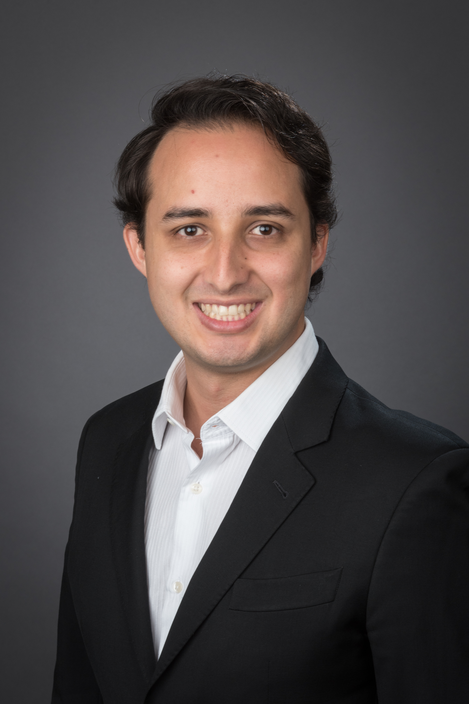

---
---

<link rel="stylesheet" href="styles.css" type="text/css">

I am a curious, results driven and action-oriented leader who has worked internationally on a variety of projects. In my previous positions, I worked as a Consultant for clients coming mainly from the retail, pharmaceutical and transportation industries.

Currently, I am pursuing a MS in Business Analytics at Rady, UC San Diego to expand my ability to unlock profitable insights through business analytics to its highest levels. Through my education and work experience, I have acquired a passion for diving deep into data analysis and then emerging to communicate key findings in a simple way.

My CV is available [here](files/rsi_CV_2019_03.pdf).
